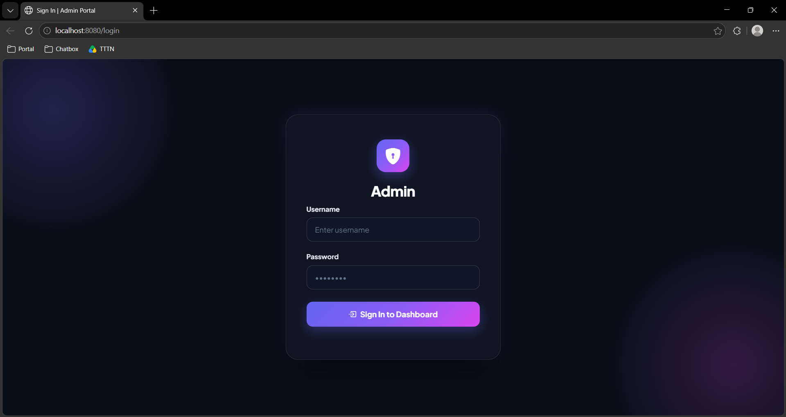
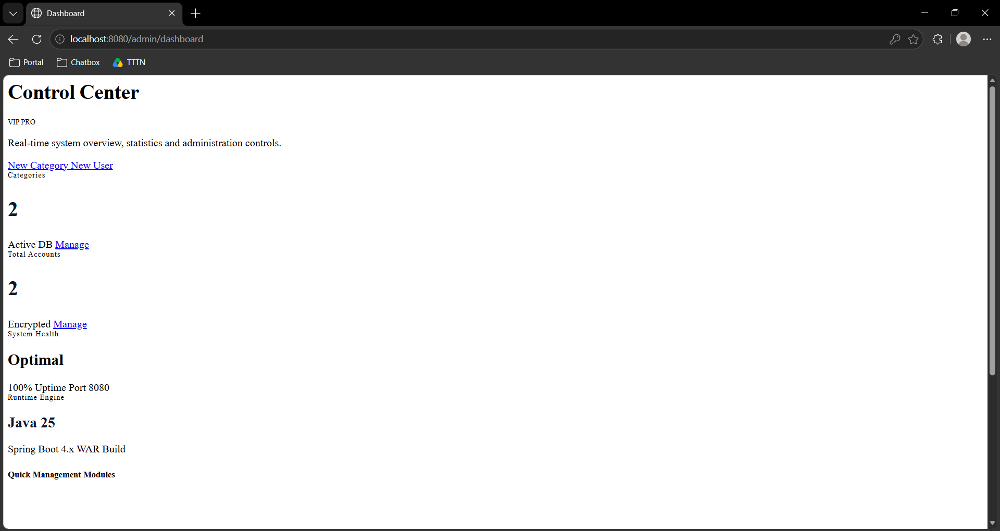
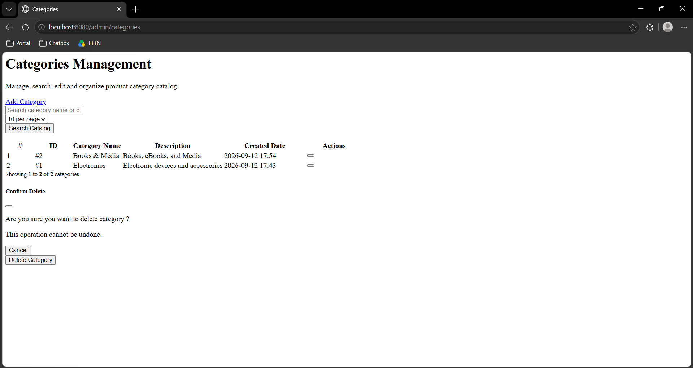
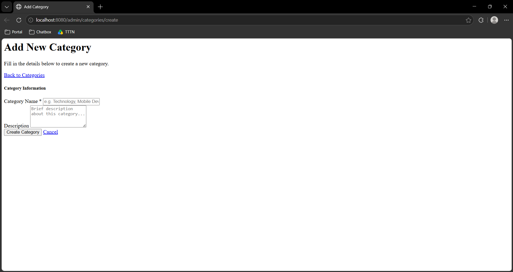
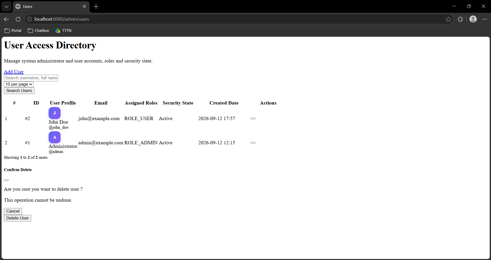
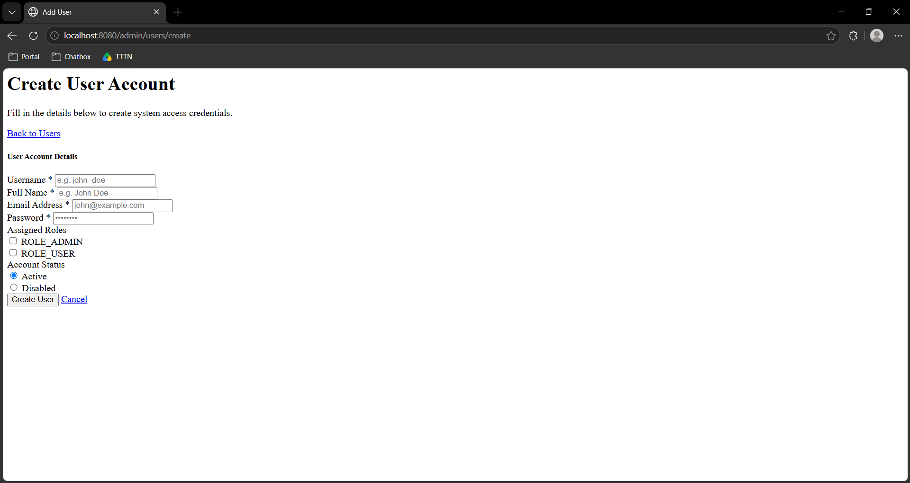

# Web Assignment 5

> Student: Lý Võ Mỹ Hoa - 24133017

## Default Account

| Field | Value |
|---|---|
| Username | `admin` |
| Password | `admin123` |
| Role | `ROLE_ADMIN` |

## URLs

- Login: [http://localhost:8080/login](http://localhost:8080/login)
- Admin Dashboard: [http://localhost:8080/admin/dashboard](http://localhost:8080/admin/dashboard)
- Category Admin (List / Search / Paging): [http://localhost:8080/admin/categories](http://localhost:8080/admin/categories)
- Add Category: [http://localhost:8080/admin/categories/create](http://localhost:8080/admin/categories/create)
- User Admin (List / Search / Paging): [http://localhost:8080/admin/users](http://localhost:8080/admin/users)
- Add User: [http://localhost:8080/admin/users/create](http://localhost:8080/admin/users/create)

## SiteMesh Configuration

- Filter configuration: `src/main/java/hcmute/admin_crud/config/SiteMeshConfig.java`
- Decorator mapping: `src/main/webapp/WEB-INF/sitemesh3.xml`
- Shared Bootstrap layout: `src/main/webapp/WEB-INF/views/decorators/admin.jsp`
- Page content: `src/main/webapp/WEB-INF/views/`

## Screenshots

### Login & Authentication

### SiteMesh Admin Dashboard

### Category Management

### Category Create

### User Management

### User Create

